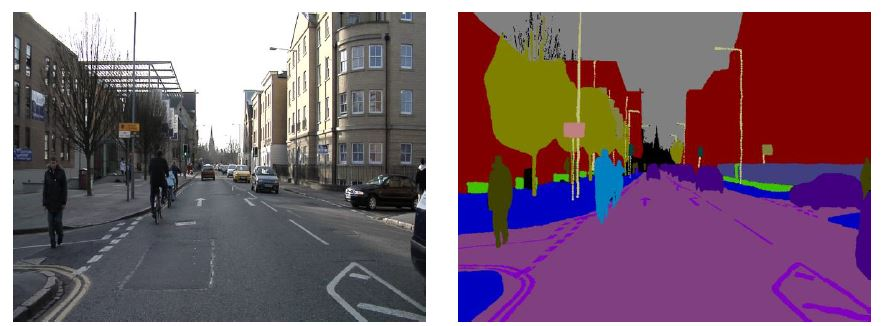

# FCN8s Semantic Segmentation

## Project Overview

This project involves training and evaluating an FCN8s (Fully Convolutional Network) model for semantic segmentation using the CamVid dataset. The goal is to segment images into different classes such as roads, vehicles, pedestrians, etc. The model is based on a VGG16 backbone and is evaluated using metrics such as pixel accuracy and Mean Intersection over Union (Mean IoU).


## Features

- **Training**: Train the FCN8s model on the CamVid dataset.
- **Evaluation**: Evaluate the model's performance using pixel accuracy and Mean IoU metrics.
- **Inference**: Generate and visualize semantic segmentation predictions on test images.
- **Visualization**: Compare predictions with ground truth images.

## Table of Contents

- [Installation](#installation)
- [Usage](#usage)
  - [Training](#training)
  - [Evaluation](#evaluation)
  - [Inference](#inference)
  - [Visualization](#visualization)
- [File Structure](#file-structure)
- [Notes](#notes)

## Installation

To run this project, you need to have Python and the required packages installed. Follow these steps:

1. Clone the repository:
   ```bash
   git clone https://github.com/SepNem32bit/fcn8s-semantic-segmentation.git
   cd fcn8s-semantic-segmentation
   ```
  
2. Create a virtual environment and activate it:
  ```bash
  python -m venv venv
  source venv/bin/activate  # On Windows use venv\Scripts\activate
```

3. Install the required packages:
  ```bash
  pip install -r requirements.txt
  Download the CamVid dataset and place it in the appropriate directory (details below).
```

## Usage
Open the Jupyter Notebook file FCN8s_Semantic_Segmentation.ipynb and follow the instructions provided in the notebook. Below is a summary of the key steps.

## Training
Prepare your dataset:
Download the CamVid dataset and extract it to a directory.
Update the dataset paths in the notebook if necessary.
Run the training cells in the notebook. This will train the model and save the trained weights, training loss, and validation loss.

## Evaluation
To evaluate the trained model on the validation set, run the evaluation cells in the notebook. This will output pixel accuracy and Mean IoU metrics.

## Inference
To make predictions on new images, run the inference cells in the notebook. This will generate a segmented output image.

## Visualization
To visualize the original image, ground truth, and predictions, run the visualization cells in the notebook. This will plot and save images showing the original input, ground truth, and the model's predictions side by side.

## File Structure
FCN8s_Semantic_Segmentation.ipynb: Jupyter Notebook containing the entire workflow: training, evaluation, inference, and visualization.
model.py: Contains the FCN8s model definition.
utils.py: Utility functions for data processing and evaluation.
requirements.txt: List of required Python packages.
data/: Directory to hold the CamVid dataset.
results/: Directory where training and evaluation results are saved.
## Notes
Ensure that your dataset is correctly formatted and paths are updated in the notebook.
The normalization values in inference_transforms must match those used during training.
If you encounter issues with empty slices or mismatched dimensions, verify the data preprocessing and model output.
